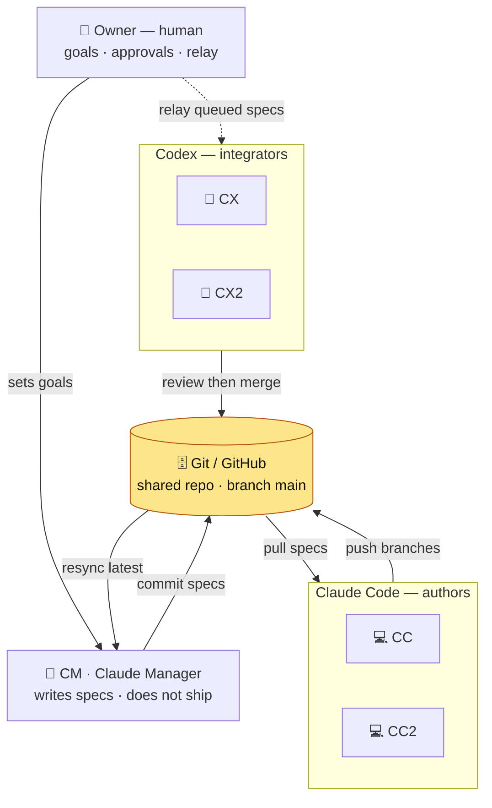
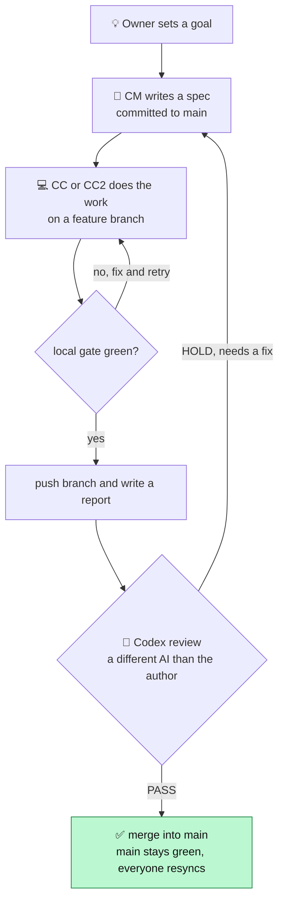

# How We Collaborate — the project workflow (for a casual observer)

This project is built by **one human and a small team of AI agents** who never talk to each other directly —
they coordinate entirely through a **shared git repository**. This page explains, in plain terms, who does what
and how a change travels from an idea to "landed."

## The cast

| Who | What they are | Their job |
|---|---|---|
| 👤 **Owner** | The human (you) | Sets goals, reviews results, approves, and **relays** work to the Codex agents |
| 🧭 **CM** | Claude Manager (Claude) | **Plans** the work and **writes specs** — never writes or ships the actual deliverables |
| 💻 **CC / CC2** | Claude Code (Claude) | **Authors** — pick up specs and do the work on their own feature branches |
| 🔄 **CX / CX2** | Codex | **Integrators** — independently review a finished branch and merge it into `main` |
| 🗄️ **Git / GitHub** | The repository | The **single source of truth** everyone reads from and writes to (key branch: `main`) |

Each agent runs in its **own window — often on a different PC** — and they never message one another. The git
repo is the shared whiteboard; the owner is the human relay that hands queued work to the Codex agents.

## Everyone meets in one place: the repository

Read it as a loop around the **repo (yellow)**: the manager puts specs in, the Claude authors pull them and push
their work back, and the Codex integrators (reached via the owner's relay — the dashed line) review and merge.

*(The dashed arrow is the human relay: CM can't hand work to the Codex agents directly — it prints a "dispatch
board" the owner reads and forwards.)*

## The life of one change

Top to bottom = the happy path. The two arrows that point back up are the only feedback loops: a failed local
check sends the author back to fix it, and a reviewer's **HOLD** sends it back to the manager.

## Why it's set up this way

- **Git is the only shared state.** Because the agents may be on different machines and never talk directly, the
  repository is how they hand off work, see each other's results, and stay in sync. Each one always starts by
  pulling the latest `main`.
- **Author is never the integrator — and is a different AI.** The agent that wrote a change never merges its own
  work; a **different-model** agent (Claude work is reviewed by Codex, and vice-versa) checks it first. Two
  different models are unlikely to make the *same* mistake, so this catches errors one alone would miss.
- **`main` is always green.** Every change must pass an automated quality gate (`tools/doc_check.py` — links
  resolve, no placeholders, diagrams and math render) before it can be pushed or merged. The shared branch is
  never left broken.
- **CM plans, but doesn't ship.** Keeping planning (specs) separate from doing (deliverables) and checking
  (integration) means no single agent both decides *and* lands a change unchecked.
- **The owner stays in control.** Goals, approvals, and the relay of work to the Codex agents all run through the
  human — the agents propose and prepare, the owner decides.

## Revision history

| Date | Spec | Agent | Change |
|---|---|---|---|
| 2026-06-08 | — | CM | Created the collaboration-workflow page: cast, two Mermaid diagrams (coordination + change lifecycle), and the rationale. |
| 2026-06-08 | — | CM | Readability pass: grouped agents into subgraphs to cut line-crossings, styled the repo hub, removed the wrap-around edge, and dropped parentheses from labels. |
